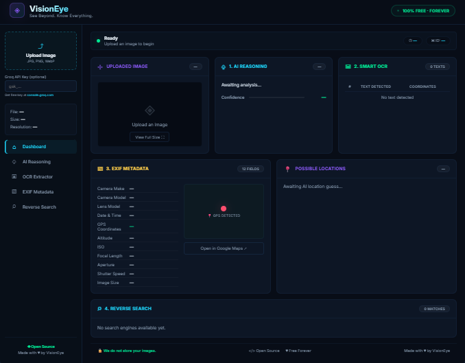

# 👁️ VisionEye – AI Image OSINT

**See Beyond. Know Everything.**

[](https://opensource.org/licenses/MIT)
[](https://python.org)
[](https://fastapi.tiangolo.com/)
[](https://github.com/Swapnil0x17/VisionEye/graphs/contributors)
[](http://makeapullrequest.com)

**VisionEye** is a free, open‑source intelligence (OSINT) tool that extracts hidden information from images – just upload and explore.

---

## 📸 Dashboard Preview



> *Upload an image and instantly see AI reasoning, OCR, EXIF, GPS location, and reverse search results.*

---

## ⚡ Features

| Feature | Description |
|---------|-------------|
| 🧠 **AI Reasoning** | Clean, factual description of the image content |
| 📝 **Smart OCR** | Text extraction with precise bounding‑box coordinates |
| 📸 **EXIF Metadata** | Camera, GPS, date, ISO, aperture, shutter speed |
| 🗺️ **GPS to Location** | City/country via OpenStreetMap reverse geocoding |
| 🌍 **Possible Locations** | AI‑guessed places even when EXIF is missing |
| 🔍 **Reverse Image Search** | One‑click Google Lens, TinEye, Yandex, Bing |

---

## 🛠️ Tech Stack

- **Backend:** FastAPI (Python)
- **OCR:** Tesseract
- **AI:** Groq (Qwen vision model)
- **Frontend:** HTML5, CSS3, JavaScript (single‑page app)
- **Hosting:** Local / Fly.io / Render / Railway

---

## 🚀 Quick Start (Local)

```bash
# Clone the repository
git clone https://github.com/Swapnil0x17/VisionEye.git
cd VisionEye

# Create and activate virtual environment
python -m venv venv
venv\Scripts\Activate.ps1   # Windows
# source venv/bin/activate   # Linux/macOS

# Install dependencies
pip install -r requirements.txt

# Create .env file with your Groq API key
echo "GROQ_API_KEY=your_key_here" > .env

# Run the server
uvicorn main:app --host 127.0.0.1 --port 8000 --reload